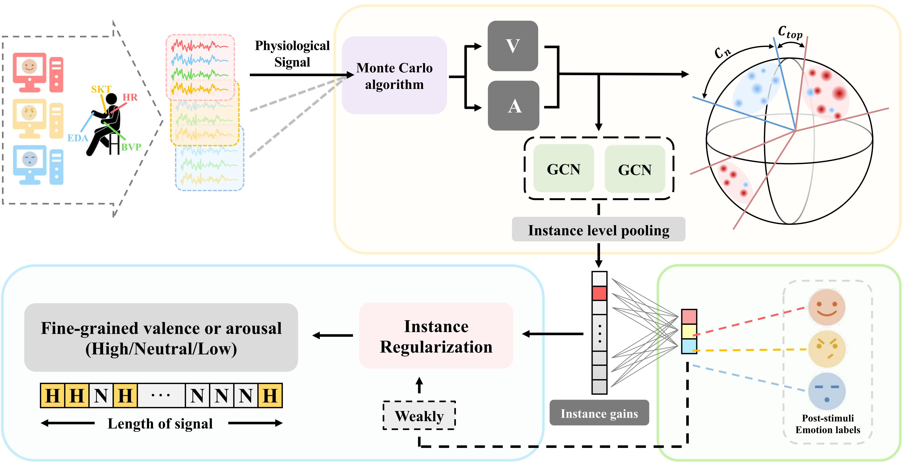

# GRM4WFER_MM2024

Group-wise Relation Mining for Weakly-supervised Fine-grained Multimodal Emotion Recognition.

These are the source code and experimental setups for the Continuously Annotated Signals of Emotion (CASE) and Continuous Physiological and Behavioral Emotion Annotation Dataset for 360&deg; Videos (CEAP-360VR) datasets.

## Datasets
We evaluate our model on the CASE dataset and the CEAP-360VR dataset.
 - The CASE dataset is available [here](https://gitlab.com/karan-shr/case_dataset), and we provide the pipeline to run GRM4WFER on it.
 - The CEAP-360VR dataset is an open-access and collaborative database. Information on how to obtain it can be found [here](https://github.com/cwi-dis/CEAP-360VR-Dataset).

## Requirements
 - Python 3.6
 - CUDA 10.1
 - cuDNN 7.6.5
 - pytorch 1.10.1
 - scipy 1.5.4
 - scikit-learn 0.24.2
   
## How to run
1. **Get Dataset**
 - Access the dataset through the above links.
 - The dataset includes physiological signals and corresponding annotations.
2. **Preprocessing**
 - After downloading the dataset, preprocess the data according to its original instruction.
 - Ensure that the data is formatted correctly and place each of them as a separate folder for input into the model.
3. **Execution**
 - Ensure that all dependencies are installed and configured properly before running the code.
 - Modify the code as necessary to specify the file paths and parameters according to your dataset and experimental setup.
 - Execute the provided code ' python subject_main.py  --data_path './CASE/' --cuda 0 --seed 1 --task 'valence' ' to train and evaluate the model.
4. **Output**
 - Upon successful execution, the code will generate output files containing model predictions, evaluation metrics, and possibly visualizations.
 - Analyze the output to interpret the results and compare them with our findings in the paper.
